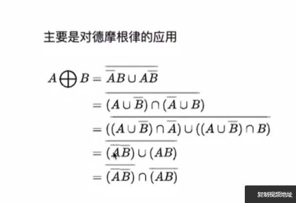

# Datalab

## 1.bitXor

德摩根律。



```c
int bitXor(int x, int y) {
   //De Morgan's laws
   return ~(~x&~y)&~(x&y);
}
```

## 2.Tmin

Tmin:10000000000000000000000000000000

10000000000000000000000000000	000<<31 = 10000000000000000000000000000000

## 3.isTmax

