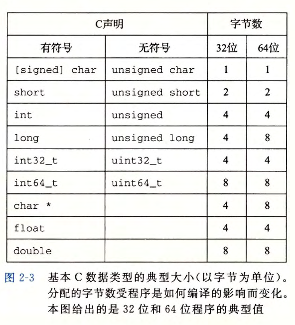
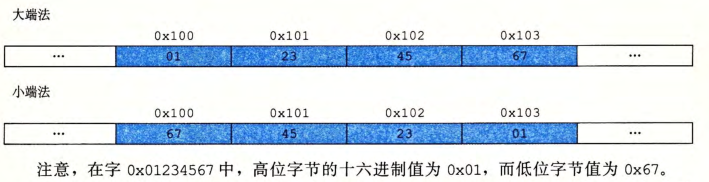
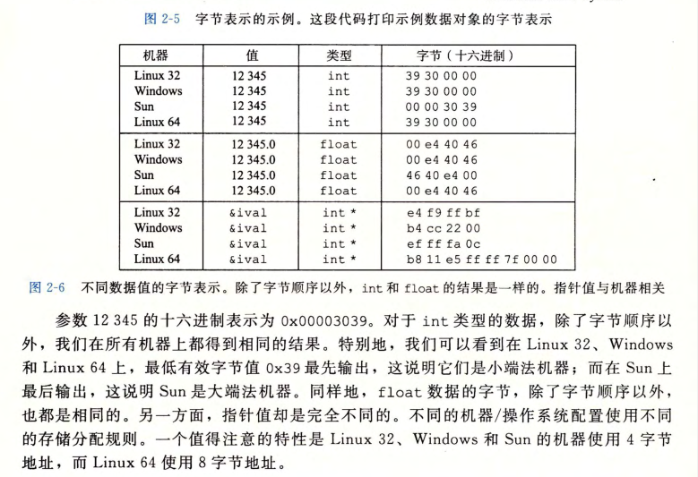
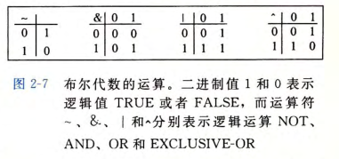
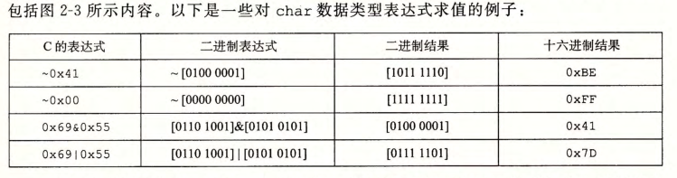
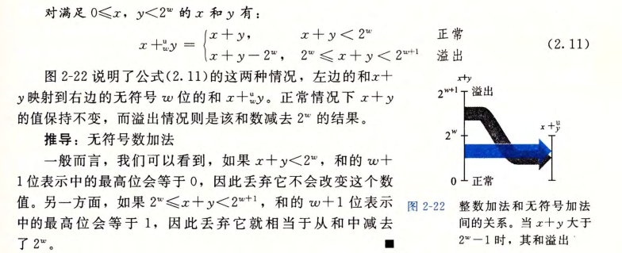
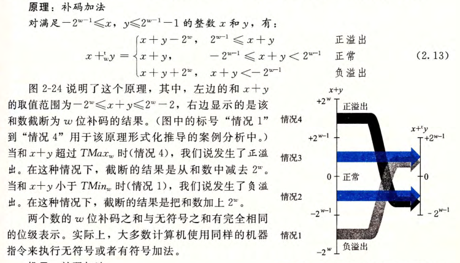
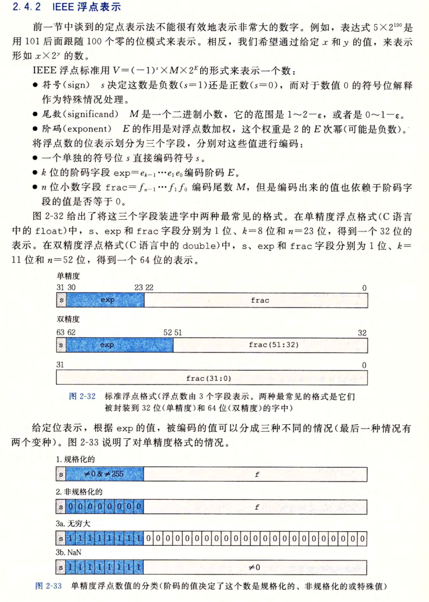
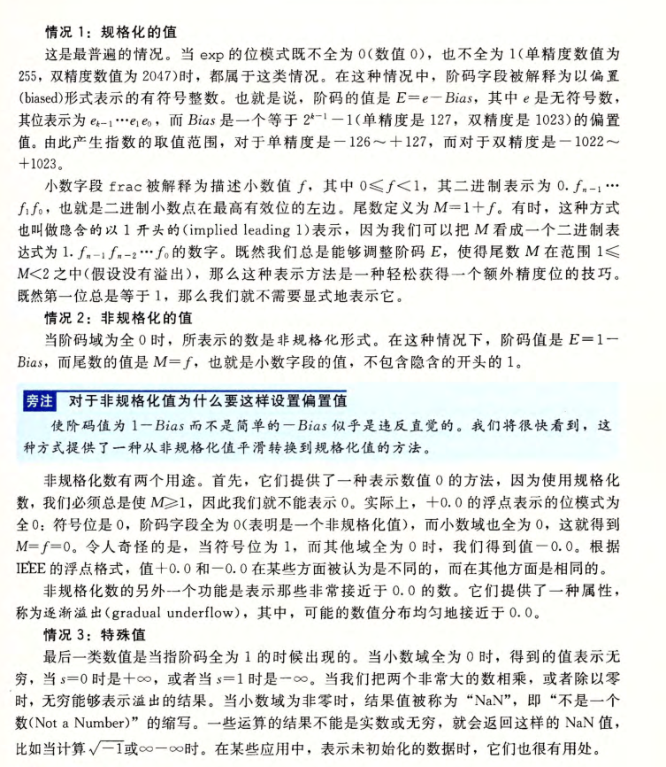

# 信息的表示和处理

## 数据大小



## 寻址和字节序


### Little endian：数据的低位在低地址，高位在高地址

### Big endian：与little endian相反

图示：





## 布尔代数和位运算

### 四种布尔运算：~ & | ^



### C 语言中的位级运算

C 语言支持按位布尔运算。



### C 语言中的移位运算

移位运算是从左至右可结合的

#### 左移：

 x 向左移动 K 位，丢弃最高的 K 位，并在右端补 K 个 0

#### 右移：

逻辑右移在左端补k 个0，算术右移是在左端补 K 个最高有效位的值

### 利用位运算交换两个变量：

```c
void inplace_swap(int *a, int *b) {
    *a = *a ^ *b;
    *b = *a ^ *b; //*a ^ *b ^ *b = *a ^0x0 = *a
    *a = *a ^ *b; //*a ^ *a ^ *b = 0x0 ^ *b = *b;
}
```

## 整数表示：

### 无符号数：

Binary to Unsigned:
$$
:B2U_w(x)=\sum_{i=0}^{w-1}x_i*2^i
$$

### 二进制补码

Binary to Two's-complement :
$$
B2T_w(x)=-x_{w-1}2^{w-1}+\sum_{i=0}^{w-2}x_i*2^i
$$

#### 隐式类型转换：

当执行一个运算时，如果它的一个运算数是有符号的而另一个是无符号的，那么 C语言会隐式地将有符号参数强制类型转换为无符号数，并假设这两个数都是非负的，来执行这个运算。

#### 扩展一个数字的位表示：

要将一个无符号数转换为一个更大的数据类型，我们只要简单地在表示的开头添加 0 。这种运算被称为零扩展 (zero extension) 

将补码转换为一个更大的数据类型，只需在在开头添加符号位

#### C语言中数据转换的顺序

```c
short sx = -12345;
unsigned uy = sx;
printf("uy = %u:\t", uy);
show_bytes((byte_pointer)&uy, sizeof(unsigned));
```

把 short 转换成 unsigned 时，我们先要改变大小，之后再完成从有符号到
无符号的转换。也就是说(unsigned)sx 等价于(unsigned) (int) sx, 求值得到
4 294 954 951, 而不等价于 (unsigned) (unsigned short) sx, 后者求值得到
53 191 。事实上，这个规则是 C 语言标准要求的。、

#### 截断数字：

int转short直接截断高16位

```c
int x = 53191;
short sx = (short) x; /* -12345 */
int y = sx;           /* -12345 */
```

## 整数运算

### 无符号加法



溢出：0<=x, y<2^w x+y如果溢出直接将结果截断到w位

判断是否溢出：x+y=s s<x说明溢出。原理：如果溢出s=x+y-2^w, y < 2^w，可得s<x

补码加法：



## 浮点数







